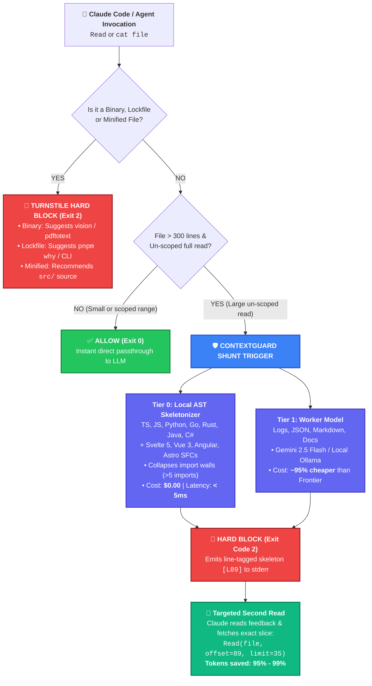

# 🛡️ ContextGuard

[](https://opensource.org/licenses/MIT)
[](https://nodejs.org/)
[](https://pnpm.io/)
[-blue.svg)](https://www.typescriptlang.org/)
[-00ADD8.svg)](https://golang.org/)

> **Intelligent context admission control & token optimization for Claude Code, Cursor, and Agentic AI workflows.**

Stop burning expensive tokens and degrading reasoning accuracy. `ContextGuard` intercepts un-scoped, large file reads before they enter your frontier reasoning models (Claude Opus 5, Claude Sonnet 5, GPT-6 Astra), extracting structural signatures or delegating summarization to ultra-fast worker models (Gemini 3.8 Flash, local SLMs).

---

## ⚡ High-Performance Go Native Compiler (TypeScript 7.0)

ContextGuard is built on **TypeScript 7.0**, utilizing the native **Go-based compiler engine** (*Corsa*):
* **10x Faster Compilation:** Type-checking and build steps run directly on native machine code compiled in Go, taking full advantage of Apple Silicon / ARM64 and multi-threaded Goroutines.
* **Sub-Millisecond Cold Starts:** Pure ESM standard library design with zero production runtime dependencies ensures the Claude Code `PreToolUse` hook executes in under **15ms**.

---

## 💡 The Problem

Frontier models are incredible at reasoning, but reading massive files (1,000+ lines of monorepo code, generated types, or verbose logs) introduces two major problems:

1. **FinOps Bleed:** Frontier models cost between \$3.00 and \$15.00+ per million input tokens. Dumping a few 2,000-line files into a session quickly adds up to dozens of dollars per day per developer.
2. **Context Rot & "Lost in the Middle":** Saturating attention heads with hundreds of lines of boilerplate degrades precision, increases hallucination rates, and derails agentic reasoning loops.

---

## 🏗️ How ContextGuard Works

ContextGuard acts as an **intelligent admission turnstile** using Claude Code's native `PreToolUse` hook lifecycle:



---

## 💡 Real-World Use Case: Before vs. After

Imagine Claude Code needs to inspect how refund errors are handled in `src/payment-gateway.ts`, a 1,500-line service file with 28 imports and several auxiliary database queries.

### ❌ Without ContextGuard (Standard Behavior)
```text
1. Claude Code executes: Read("src/payment-gateway.ts")
   └── ❌ Dumps all 1,500 lines into the frontier reasoning context
       ├── Tokens burned: ~8,500 tokens (~$0.13 in Claude Opus for a single read)
       ├── Context window saturated with 28 repetitive imports & unrelated schema logic
       └── High risk of "Lost in the Middle" attention degradation and hallucinations
```

### ✅ With ContextGuard (Context Shield Active)
```text
1. Claude Code executes: Read("src/payment-gateway.ts")
   └── 🛡️ ContextGuard intercepts in <15ms and aborts with Exit Code 2:
       🛑 [CONTEXTGUARD: READ BLOCKED (1,500 LINES)]
       [L1-L32] 📦 28 imports collapsed (12 packages: @stripe/stripe-node, express...; 16 local).
       [L45] export class PaymentGatewayService
       [L52] constructor(private stripe: Stripe, private db: Database)
       [L89] async processRefund(chargeId: string, amount: number): Promise<RefundResult>
       [L145] async verifyWebhookSignature(payload: Buffer, sig: string): boolean
       👉 Please request a targeted range using offset and limit.

2. Claude Code parses the structural skeleton and executes:
   Read("src/payment-gateway.ts", offset=89, limit=35)
   └── ✅ Allowed immediately!
       ├── Tokens consumed: ~160 tokens (instead of 8,500)
       ├── Savings: 98% token reduction and cost down to < $0.002
       └── Razor-sharp attention, pinpoint accuracy, and zero hallucinations
```

---

## 🚀 Quick Start for Claude Code

### 1. Installation

Clone or install in your workspace:

```bash
pnpm add -D @kevinbermudezc/context-guard
# Or global install:
pnpm add -g @kevinbermudezc/context-guard
```

### 2. Configure Claude Code Hook

Add ContextGuard to your `.claude/settings.json` (at project root or `~/.claude/settings.json` globally):

```json
{
  "hooks": {
    "PreToolUse": [
      {
        "matcher": "Read|Bash",
        "hooks": [
          {
            "type": "command",
            "command": "node ./node_modules/@kevinbermudezc/context-guard/dist/bin/claude-hook.js"
          }
        ]
      }
    ]
  }
}
```

That's it! When Claude Code attempts to run `Read` (or raw bash reads like `cat massive-file.ts`), ContextGuard will intercept it, extract the structural map, and instruct Claude to seek only the exact line range it needs.

---

## 🛠️ CLI Usage

You can also use ContextGuard directly as a command-line tool:

```bash
# View file through ContextGuard (auto-shunts if > 300 lines)
npx @kevinbermudezc/context-guard src/large-service.ts

# Ask a semantic question to the worker model
npx @kevinbermudezc/context-guard logs/server.log --query "Find all 500 status database connection timeouts"

# Specific line range (bypasses guard / passthrough)
npx @kevinbermudezc/context-guard src/large-service.ts --start 120 --end 160

# Output structured JSON
npx @kevinbermudezc/context-guard src/large-service.ts --json
```

---

## ⚙️ Configuration

Customize thresholds and worker models via environment variables:

| Variable | Default | Description |
| :--- | :--- | :--- |
| `CONTEXT_GUARD_MAX_LINES` | `300` | Maximum lines allowed for un-scoped direct reads |
| `CONTEXT_GUARD_MAX_BYTES` | `25600` | Maximum file size in bytes (~25 KB) |
| `CONTEXT_GUARD_PROVIDER` | `skeleton` | Worker mode: `skeleton` (Tier 0 AST), `gemini`, `ollama`, or `openai` |
| `GEMINI_API_KEY` | - | API key for Gemini 2.5 Flash worker |
| `GEMINI_MODEL` | `gemini-3.8-flash` | Gemini model name |
| `OLLAMA_BASE_URL` | `http://localhost:11434` | Ollama local endpoint |
| `OLLAMA_MODEL` | `qwen2.5-coder:7b` | Model to use in Ollama |

---

## 🧪 Development & Testing
 
```bash
# Install dependencies with strict symlink resolution
pnpm install

# Compile TypeScript using Go-powered tsc engine
pnpm run build

# Run unit and end-to-end tests
pnpm test
```

---

## 📚 Documentation & Roadmap

* **[Software Design Document (SDD)](docs/SDD.md):** Complete technical architecture, FinOps mathematical breakdown, and threat model.
* **[Product Roadmap (ROADMAP.md)](ROADMAP.md):** Vision and milestones for Universal MCP Server, native Cursor, Antigravity, Kiro, and Windsurf support.

---

## 📄 License

MIT © [Kevin Bermudez](https://github.com/kevinbermudezc)
